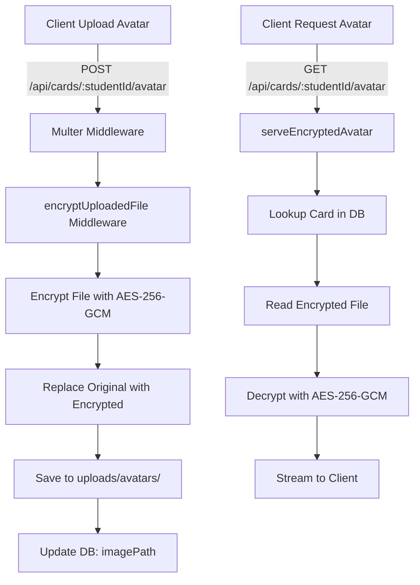

# Avatar Encryption Flow

## Tổng quan

Hệ thống mã hóa avatar sử dụng **AES-256-GCM** để bảo vệ file ảnh đại diện của người dùng. Quá trình mã hóa và giải mã hoàn toàn **transparent** - client không biết file được mã hóa.

## Kiến trúc



## Chi tiết luồng

### 1. Upload Flow

#### 1.1. Client gửi request
```http
POST /api/cards/:studentId/avatar
Content-Type: multipart/form-data
Authorization: Bearer <token>

avatar: <file>
```

#### 1.2. Server xử lý (middleware chain)
```javascript
upload.single('avatar')  // Multer saves file temporarily
  ↓
encryptUploadedFile     // Encrypt the file
  ↓
cardController.uploadAvatar  // Update database
```

#### 1.3. Encryption Process (`encryptUploadedFile`)
1. **Read** file gốc từ disk
2. **Generate** random IV (16 bytes)
3. **Encrypt** file content với AES-256-GCM
4. **Create** encrypted file format:
   ```
   [IV (16 bytes)][Auth Tag (16 bytes)][Encrypted Data]
   ```
5. **Replace** file gốc với file encrypted
6. **Continue** to controller

#### 1.4. Database Update
```javascript
{
  imagePath: "uploads/avatars/CT123456_1234567890.jpg",
  // File này đã được encrypt trên disk
}
```

#### 1.5. Response to Client
```json
{
  "success": true,
  "message": "Upload ảnh đại diện thành công",
  "data": {
    "imagePath": "uploads/avatars/CT123456_1234567890.jpg",
    "imageUrl": "/api/cards/CT123456/avatar",
    "card": { ... }
  }
}
```

### 2. Serve Flow

#### 2.1. Client request avatar
```http
GET /api/cards/:studentId/avatar
```

**Lưu ý:** Client không cần authentication để xem avatar (public endpoint)

#### 2.2. Server xử lý (`serveEncryptedAvatar`)

**Bước 1: Lookup Card**
```javascript
const card = await Card.findOne({ where: { studentId } });
const imagePath = card.imagePath; // "uploads/avatars/..."
```

**Bước 2: Read Encrypted File**
```javascript
const encryptedData = await fs.readFile(imagePath);
// Format: [IV][Auth Tag][Encrypted Data]
```

**Bước 3: Extract Components**
```javascript
const iv = encryptedData.slice(0, 16);
const authTag = encryptedData.slice(16, 32);
const encrypted = encryptedData.slice(32);
```

**Bước 4: Decrypt**
```javascript
const decipher = crypto.createDecipheriv('aes-256-gcm', key, iv);
decipher.setAuthTag(authTag);
const decrypted = Buffer.concat([
  decipher.update(encrypted),
  decipher.final()
]);
```

**Bước 5: Stream to Client**
```javascript
res.setHeader('Content-Type', 'image/jpeg');
res.setHeader('Content-Length', decrypted.length);
res.setHeader('Cache-Control', 'public, max-age=86400');
res.send(decrypted);
```

## Security Features

### 1. Encryption Key Management
- **Key Storage:** Environment variable `FILE_ENCRYPTION_KEY`
- **Key Length:** 32 bytes (256 bits)
- **Key Format:** Hex string (64 characters)
- **Generation:** `crypto.randomBytes(32).toString('hex')`

### 2. Encryption Algorithm
- **Algorithm:** AES-256-GCM
- **Mode:** Galois/Counter Mode (authenticated encryption)
- **IV:** Random 16 bytes per file
- **Auth Tag:** 16 bytes for integrity verification

### 3. Security Benefits
- ✅ **Confidentiality:** File content không thể đọc được trên disk
- ✅ **Integrity:** Auth tag đảm bảo file không bị sửa đổi
- ✅ **Access Control:** Chỉ có thể truy cập qua API endpoint
- ✅ **Transparent:** Client không biết file được mã hóa

## File Structure

### Encrypted File Format
```
┌─────────────┬──────────────┬──────────────────┐
│ IV (16B)    │ Auth Tag(16B)│ Encrypted Data   │
├─────────────┼──────────────┼──────────────────┤
│ Random      │ GMAC         │ AES-256-GCM      │
└─────────────┴──────────────┴──────────────────┘
```

### Directory Structure
```
server/
├── uploads/
│   └── avatars/
│       ├── CT123456_1234567890.jpg  (encrypted)
│       └── CT789012_9876543210.png  (encrypted)
├── middleware/
│   ├── upload.js                    (encryption middleware)
│   └── serveEncryptedFile.js        (decryption middleware)
└── utils/
    └── fileEncryption.js            (crypto utilities)
```

## Code Components

### 1. Encryption Utility (`utils/fileEncryption.js`)
```javascript
// Core functions
encryptBuffer(buffer)      // Encrypt data in memory
decryptBuffer(buffer)      // Decrypt data in memory
encryptFile(in, out)       // Encrypt file on disk
decryptFile(in, out)       // Decrypt file on disk
generateKey()              // Generate new encryption key
```

### 2. Upload Middleware (`middleware/upload.js`)
```javascript
// Multer configuration
const upload = multer({ storage, limits, fileFilter });

// Encryption middleware
async function encryptUploadedFile(req, res, next) {
  // Encrypt file after multer saves it
}

module.exports = upload;
module.exports.encryptUploadedFile = encryptUploadedFile;
```

### 3. Serve Middleware (`middleware/serveEncryptedFile.js`)
```javascript
async function serveEncryptedAvatar(req, res) {
  // 1. Lookup card by studentId
  // 2. Read encrypted file
  // 3. Decrypt file
  // 4. Stream to client
}
```

### 4. Routes (`routes/cardRoutes.js`)
```javascript
// Upload with encryption
router.post('/:studentId/avatar', 
  authenticate, 
  upload.single('avatar'), 
  upload.encryptUploadedFile,  // ← Encryption happens here
  cardController.uploadAvatar
);

// Serve with decryption
router.get('/:studentId/avatar', 
  serveEncryptedAvatar  // ← Decryption happens here
);
```

## Environment Setup

### Required Environment Variables
```bash
# .env file
FILE_ENCRYPTION_KEY=<64-character-hex-string>
```

### Generate New Key
```bash
node -e "console.log(require('crypto').randomBytes(32).toString('hex'))"
```

**⚠️ IMPORTANT:**
- Never commit encryption key to git
- Use different keys for dev/staging/production
- Store production key in secure vault (AWS Secrets Manager, etc.)
- Backup key securely - encrypted files cannot be recovered if key is lost

## Client Integration

### Java Client Avatar Loading
```java
// CardInfoPage.java
private boolean loadImage(String imagePath) {
    if (imagePath.startsWith("uploads/avatars/")) {
        // Use decryption endpoint
        String studentId = cardInfo.getStudentId();
        String url = SERVER_URL + "/api/cards/" + studentId + "/avatar";
        return loadImageFromUrl(url);
    }
    // ... handle local files
}
```

### After Upload
```java
// CardInfoPage.java - handleUploadImage()
CardInfo updated = cardApi.uploadAvatar(studentCode, selectedFile);
if (updated != null) {
    // Load from decryption endpoint
    String imageUrl = SERVER_URL + "/api/cards/" + studentCode + "/avatar";
    loadImageFromUrl(imageUrl);
}
```

## Performance Considerations

### 1. Caching
```javascript
res.setHeader('Cache-Control', 'public, max-age=86400'); // 1 day
```
- Browser caches decrypted image
- Reduces server load
- Improves user experience

### 2. File Size Overhead
- **IV:** +16 bytes
- **Auth Tag:** +16 bytes
- **Total Overhead:** +32 bytes per file
- **Impact:** Negligible for typical avatar sizes (50KB-500KB)

### 3. Decryption Performance
- AES-256-GCM is hardware-accelerated on modern CPUs
- Typical decryption time: <10ms for 500KB file
- Minimal impact on response time

## Error Handling

### Upload Errors
```javascript
// Encryption fails
→ Delete unencrypted file
→ Return 500 error
→ Client can retry upload
```

### Serve Errors
```javascript
// Card not found → 404
// File not found → 404
// Decryption fails → 500
// Invalid key → 500 (logged)
```

## Migration Notes

### Existing Avatars
- **Old avatars** (uploaded before encryption): Unencrypted on disk
- **New avatars** (uploaded after encryption): Encrypted on disk
- **Recommendation:** Re-upload all avatars or run migration script

### Migration Script (if needed)
```javascript
// Encrypt all existing avatars
const files = await fs.readdir('uploads/avatars/');
for (const file of files) {
  const path = `uploads/avatars/${file}`;
  await encryptFile(path, path + '.tmp');
  fs.unlinkSync(path);
  fs.renameSync(path + '.tmp', path);
}
```

## Testing

### Manual Testing
1. Upload new avatar via client
2. Verify file on disk is unreadable (encrypted)
3. Request avatar via browser: `http://localhost:3000/api/cards/CT123456/avatar`
4. Verify image displays correctly

### Security Testing
1. Try to access file directly: `http://localhost:3000/uploads/avatars/...` → Should fail (404)
2. Verify encrypted file cannot be opened as image
3. Test with corrupted encrypted file → Should return 500
4. Test with missing encryption key → Should return 500

## Troubleshooting

### Avatar not loading
1. Check encryption key is set in `.env`
2. Check server logs for decryption errors
3. Verify file exists on disk
4. Check `imagePath` in database

### Upload fails
1. Check file size limits (5MB default)
2. Check file type (jpg, png, gif, webp, svg)
3. Check disk space
4. Check encryption key is valid

### Performance issues
1. Check file sizes (compress large images)
2. Enable browser caching
3. Consider CDN for production
4. Monitor decryption time in logs
