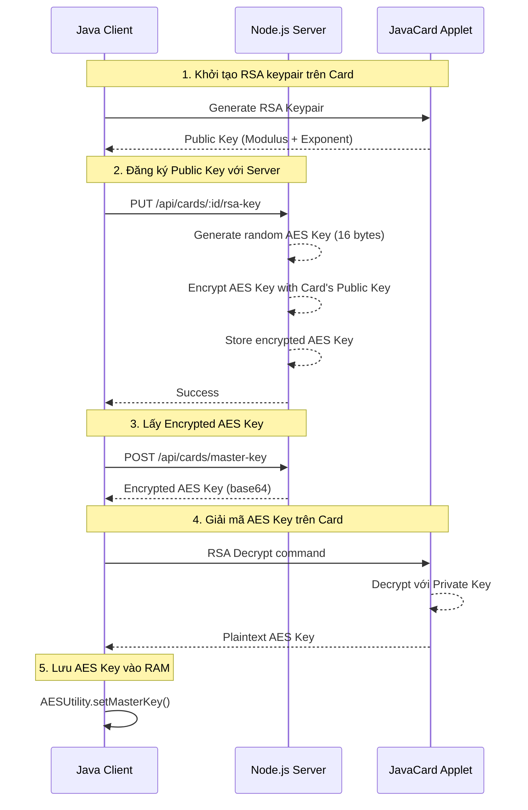

# Quy trình Lấy và Giải mã AES Key

> [!NOTE]
> Tài liệu này mô tả chi tiết từng bước trong quy trình lấy AES Key từ Server và giải mã trên Card, bao gồm các hàm và file liên quan.

## 📋 Tổng quan

Hệ thống sử dụng cơ chế **Hybrid Encryption** kết hợp RSA và AES:
- **RSA (1024-bit)**: Mã hóa và vận chuyển AES Key an toàn
- **AES (128-bit)**: Mã hóa dữ liệu thực tế (thông tin thẻ, số dư)

### Luồng tổng thể



---

## 🔄 Chi tiết từng bước

### Bước 1: Tạo RSA Keypair trên Card

#### 1.1. Client gọi hàm tạo keypair

**File**: [`SimulatorService.java`](file:///e:/Code/javacard/card_gui/src/service/SimulatorService.java#L836-L857)  
**Hàm**: `generateRSAKeyPair()`

```java
public byte[] generateRSAKeyPair() throws Exception {
    byte[] cmd = new byte[5];
    cmd[0] = (byte)0x00;  // CLA
    cmd[1] = AppletConstants.INS_RSA_GENERATE_KEYPAIR; // 0xB0
    cmd[2] = (byte)0x00;
    cmd[3] = (byte)0x00;
    cmd[4] = (byte)0x00;
    
    byte[] resp = sendCommand(cmd);
    // Response: [MODULUS (128 bytes)] [EXPONENT (3 bytes)]
    return publicKeyData;
}
```

#### 1.2. Card xử lý lệnh tạo keypair

**File**: [`LibraryCardApplet.java`](file:///e:/Code/javacard/card_gui/src/applet/LibraryCardApplet.java#L116-L122)  
**Router**: Forward đến `RSAAuthenticationManager`

```java
case AppletConstants.INS_RSA_GENERATE_KEYPAIR:
    rsaAuthManager.generateKeyPair(apdu);
    break;
```

**File**: [`RSAAuthenticationManager.java`](file:///e:/Code/javacard/card_gui/src/applet/RSAAuthenticationManager.java#L37-L69)  
**Hàm**: `generateKeyPair(APDU apdu)`

```java
public void generateKeyPair(APDU apdu) {
    // 1. Tạo cặp khóa RSA 1024-bit
    KeyPair rsaKeyPair = new KeyPair(KeyPair.ALG_RSA, AppletConstants.RSA_KEY_SIZE);
    rsaKeyPair.genKeyPair();
    
    // 2. Lưu Private Key và Public Key
    privateKey = (RSAPrivateKey) rsaKeyPair.getPrivate();
    publicKey = (RSAPublicKey) rsaKeyPair.getPublic();
    keyPairGenerated = true;
    
    // 3. Trả về Public Key
    // Output: [Modulus 128 bytes] [Exponent 3 bytes]
    short modulusLen = publicKey.getModulus(buffer, offset);
    Util.arrayCopy(publicExponent, (short)0, buffer, offset, (short)3);
    apdu.setOutgoingAndSend((short)0, offset);
}
```

**Kết quả**: Card trả về 131 bytes: `[Modulus (128)] [Exponent (3)]`

---

### Bước 2: Đăng ký Public Key với Server

#### 2.1. Client gửi Public Key lên Server

**File**: [`SimulatorService.java`](file:///e:/Code/javacard/card_gui/src/service/SimulatorService.java#L1214-L1272)  
**Hàm**: `registerRSAPublicKey(String studentId)`

```java
public void registerRSAPublicKey(String studentId) throws Exception {
    // 1. Lấy Public Key từ Card
    byte[] pubKeyData = getRSAPublicKey();
    
    // 2. Parse Modulus và Exponent
    byte[] modulus = new byte[128];
    byte[] exponent = new byte[3];
    System.arraycopy(pubKeyData, 0, modulus, 0, 128);
    System.arraycopy(pubKeyData, 128, exponent, 0, 3);
    
    String modulusHex = bytesToHex(modulus);
    String exponentHex = bytesToHex(exponent);
    
    // 3. Gửi đến Server qua HTTP PUT
    String endpoint = "http://localhost:3000/api/cards/" + studentId + "/rsa-key";
    String jsonInputString = String.format(
        "{\"rsaModulus\": \"%s\", \"rsaExponent\": \"%s\"}", 
        modulusHex, exponentHex
    );
    // ... HTTP request code
}
```

#### 2.2. Server nhận và xử lý

**File**: [`cardController.js`](file:///e:/Code/javacard/server/controllers/cardController.js#L364-L448)  
**Hàm**: `updateRSAPublicKey(req, res)`

```javascript
exports.updateRSAPublicKey = async (req, res) => {
    const { studentId } = req.params;
    const { rsaModulus, rsaExponent } = req.body;
    
    // 1. Chuyển đổi RSA key từ JavaCard format sang PEM
    let rsaPublicKeyPEM = convertRSAPublicKeyToPEM(rsaModulus, rsaExponent);
    
    // 2. Tạo Random AES Key (16 bytes)
    const randomAesKey = crypto.randomBytes(16);
    console.log('[DEBUG] Generated random AES key (16 bytes)');
    
    // 3. Mã hóa AES Key bằng RSA Public Key của Card
    const encryptedAesKeyBuffer = crypto.publicEncrypt(
        {
            key: rsaPublicKeyPEM,
            padding: crypto.constants.RSA_PKCS1_PADDING,
        },
        randomAesKey
    );
    
    // 4. Lưu Encrypted AES Key vào database
    card.rsaPublicKey = rsaPublicKeyPEM;
    card.encryptedAesKey = encryptedAesKeyBuffer.toString('base64');
    await card.save();
    
    res.json({ success: true, message: 'Cập nhật khóa RSA và tạo AES Key thành công' });
};
```

**File**: [`cardController.js`](file:///e:/Code/javacard/server/controllers/cardController.js#L10-L36)  
**Hàm helper**: `convertRSAPublicKeyToPEM(modulusHex, exponentHex)`

```javascript
const convertRSAPublicKeyToPEM = (modulusHex, exponentHex) => {
    // Chuyển hex strings thành Buffer
    const modulus = Buffer.from(modulusHex, 'hex');
    const exponent = Buffer.from(exponentHex, 'hex');
    
    // Tạo RSA public key object (JWK format)
    const publicKey = crypto.createPublicKey({
        key: {
            kty: 'RSA',
            n: modulus.toString('base64url'),
            e: exponent.toString('base64url')
        },
        format: 'jwk'
    });
    
    // Export sang PEM format
    return publicKey.export({ type: 'spki', format: 'pem' });
};
```

**Kết quả**: Server lưu `encryptedAesKey` (base64) vào database

---

### Bước 3: Lấy Encrypted AES Key từ Server

#### 3.1. Client request Encrypted AES Key

**File**: [`SimulatorService.java`](file:///e:/Code/javacard/card_gui/src/service/SimulatorService.java#L1274-L1363)  
**Hàm**: `fetchMasterKeyFromServer(String studentId)`

```java
public void fetchMasterKeyFromServer(String studentId) throws Exception {
    // 1. Lấy Public Key từ Card
    byte[] pubKeyData = getRSAPublicKey();
    
    // 2. Parse Modulus và Exponent
    byte[] modulus = new byte[128];
    byte[] exponent = new byte[3];
    System.arraycopy(pubKeyData, 0, modulus, 0, 128);
    System.arraycopy(pubKeyData, 128, exponent, 0, 3);
    
    String modulusHex = bytesToHex(modulus);
    String exponentHex = bytesToHex(exponent);
    
    // 3. Gọi Server API
    URL url = new URL("http://localhost:3000/api/cards/master-key");
    HttpURLConnection conn = (HttpURLConnection) url.openConnection();
    conn.setRequestMethod("POST");
    
    String jsonInputString = String.format(
        "{\"studentId\": \"%s\", \"rsaModulus\": \"%s\", \"rsaExponent\": \"%s\"}", 
        studentId, modulusHex, exponentHex
    );
    
    // ... Gửi request và nhận response
}
```

#### 3.2. Server trả về Encrypted AES Key

**File**: [`cardController.js`](file:///e:/Code/javacard/server/controllers/cardController.js#L492-L563)  
**Hàm**: `getEncryptedMasterKey(req, res)`

```javascript
exports.getEncryptedMasterKey = async (req, res) => {
    const { studentId, rsaModulus, rsaExponent } = req.body;
    
    // 1. Tìm Card theo studentId
    let card = await Card.findOne({ where: { studentId } });
    
    if (!card || !card.encryptedAesKey) {
        return res.status(404).json({
            success: false,
            message: 'Không tìm thấy thẻ hoặc chưa có AES Key'
        });
    }
    
    // 2. Trả về Encrypted AES Key (đã được mã hóa bằng Card's Public Key)
    res.json({
        success: true,
        message: 'Lấy AES Key thành công (Encrypted)',
        data: {
            encryptedMasterKey: card.encryptedAesKey, // Base64 string
            keyLength: Buffer.from(card.encryptedAesKey, 'base64').length
        }
    });
};
```

#### 3.3. Client parse JSON response

**File**: [`SimulatorService.java`](file:///e:/Code/javacard/card_gui/src/service/SimulatorService.java#L1331-L1338)

```java
// Parse JSON response
String respStr = response.toString();
String encryptedKeyB64 = extractJsonValue(respStr, "encryptedMasterKey");

// Decode base64 thành byte array
byte[] encryptedKey = java.util.Base64.getDecoder().decode(encryptedKeyB64);
// encryptedKey.length = 128 bytes (RSA modulus size)
```

**Kết quả**: Client có `encryptedKey` (128 bytes) cần giải mã

---

### Bước 4: Giải mã AES Key trên Card

#### 4.1. Client gửi lệnh RSA Decrypt đến Card

**File**: [`SimulatorService.java`](file:///e:/Code/javacard/card_gui/src/service/SimulatorService.java#L1340-L1352)

```java
// 3. Decrypt on Card
byte[] cmd = new byte[5 + encryptedKey.length];
cmd[0] = (byte)0x00;
cmd[1] = AppletConstants.INS_RSA_DECRYPT; // 0xB3
cmd[2] = (byte)0x00;
cmd[3] = (byte)0x00;
cmd[4] = (byte)encryptedKey.length; // 128 bytes

// Copy encrypted key vào command data
System.arraycopy(encryptedKey, 0, cmd, 5, encryptedKey.length);

byte[] resp = sendCommand(cmd);
if (getSW(resp) != 0x9000) {
    throw new Exception("Card Decryption failed");
}
```

**Cấu trúc APDU**: `[CLA=0x00] [INS=0xB3] [P1=0x00] [P2=0x00] [Lc=128] [Encrypted Key 128 bytes]`

#### 4.2. Card router chuyển lệnh

**File**: [`LibraryCardApplet.java`](file:///e:/Code/javacard/card_gui/src/applet/LibraryCardApplet.java#L147-L158)

```java
case AppletConstants.INS_RSA_DECRYPT:
    if (rsaAuthManager == null) {
        ISOException.throwIt((short)0x6A1B);
    }
    try {
        rsaAuthManager.decrypt(apdu);
    } catch (Exception e) {
        ISOException.throwIt(ISO7816.SW_UNKNOWN);
    }
    break;
```

#### 4.3. Card thực hiện RSA Decryption

**File**: [`RSAAuthenticationManager.java`](file:///e:/Code/javacard/card_gui/src/applet/RSAAuthenticationManager.java#L379-L414)  
**Hàm**: `decrypt(APDU apdu)`

```java
public void decrypt(APDU apdu) {
    // 1. Kiểm tra keypair đã được tạo
    if (!keyPairGenerated || privateKey == null) {
        ISOException.throwIt((short)0x6A00);
    }
    
    // 2. Nhận dữ liệu encrypted
    byte[] buffer = apdu.getBuffer();
    short len = apdu.setIncomingAndReceive();
    
    // 3. Validate độ dài (phải = 128 bytes = RSA modulus size)
    if (len != AppletConstants.RSA_MODULUS_SIZE) { // 128
        ISOException.throwIt(ISO7816.SW_WRONG_LENGTH);
    }
    
    try {
        // 4. Khởi tạo RSA Cipher với PKCS#1 padding
        Cipher cipher = Cipher.getInstance(Cipher.ALG_RSA_PKCS1, false);
        cipher.init(privateKey, Cipher.MODE_DECRYPT);
        
        // 5. Giải mã
        // Input:  buffer[OFFSET_CDATA] (128 bytes encrypted)
        // Output: buffer[0] (variable bytes decrypted)
        short decryptedLen = cipher.doFinal(
            buffer, ISO7816.OFFSET_CDATA, len, 
            buffer, (short)0
        );
        
        // 6. Gửi kết quả về Client
        apdu.setOutgoingAndSend((short)0, decryptedLen);
        
    } catch (CryptoException e) {
        ISOException.throwIt((short)0x6A13); // Decrypt failed
    }
}
```

**Giải thích chi tiết các bước trong `decrypt()`**:

1. **Validate keypair**: Đảm bảo Private Key đã được tạo
2. **Nhận dữ liệu**: Lấy encrypted key từ APDU buffer
3. **Validate length**: Encrypted data phải = 128 bytes (RSA 1024-bit modulus)
4. **Khởi tạo Cipher**: 
   - Algorithm: `ALG_RSA_PKCS1` (RSA với PKCS#1 v1.5 padding)
   - Mode: `MODE_DECRYPT`
   - Key: `privateKey` (RSA Private Key trên Card)
5. **Giải mã**: 
   - Input: 128 bytes encrypted AES key
   - Output: 16 bytes plaintext AES key (sau khi bỏ padding)
6. **Trả về**: Gửi plaintext AES key về Client

**Kết quả**: Card trả về 16 bytes plaintext AES key

---

### Bước 5: Lưu AES Key vào RAM của Client

#### 5.1. Client nhận plaintext AES Key

**File**: [`SimulatorService.java`](file:///e:/Code/javacard/card_gui/src/service/SimulatorService.java#L1354-L1362)

```java
// Decrypted data is in response (minus SW)
byte[] decryptedKeyBytes = new byte[resp.length - 2];
System.arraycopy(resp, 0, decryptedKeyBytes, 0, decryptedKeyBytes.length);

// 4. Convert bytes thành String
String masterKey = new String(decryptedKeyBytes, StandardCharsets.UTF_8);

// 5. Lưu Master Key vào RAM
AESUtility.setMasterKey(masterKey);

System.out.println("[SECURE] Master Key retrieved and set successfully.");
```

#### 5.2. AESUtility lưu key vào memory

**File**: [`AESUtility.java`](file:///e:/Code/javacard/card_gui/src/utils/AESUtility.java#L17-L45)  
**Hàm**: `setMasterKey(String masterKey)`

```java
private static byte[] aesKey;
private static String systemMasterKey; // Plaintext System Master Key (RAM only)

public static void setMasterKey(String masterKey) {
    if (masterKey == null || masterKey.isEmpty()) {
        throw new IllegalArgumentException("Master Key cannot be empty");
    }
    
    // 1. Lưu Master Key dạng String
    systemMasterKey = masterKey;
    
    // 2. Convert sang byte array (16 bytes) cho AES
    try {
        byte[] keyBytes = masterKey.getBytes("UTF-8");
        aesKey = new byte[16];
        
        // Lấy 16 bytes đầu tiên (hoặc pad nếu < 16 bytes)
        System.arraycopy(keyBytes, 0, aesKey, 0, Math.min(keyBytes.length, 16));
    } catch (Exception e) {
        e.printStackTrace();
    }
}
```

**File**: [`AESUtility.java`](file:///e:/Code/javacard/card_gui/src/utils/AESUtility.java#L47-L62)  
**Getter methods**:

```java
// Get Master Key (for Key Derivation)
public static String getMasterKey() {
    if (systemMasterKey == null) {
        throw new IllegalStateException("System Master Key not initialized");
    }
    return systemMasterKey;
}

// Check if key is initialized
public static boolean isKeyInitialized() {
    return aesKey != null && systemMasterKey != null;
}
```

**Kết quả**: AES Key được lưu trong RAM của Client application, sẵn sàng sử dụng

---

## 🔐 Sử dụng AES Key sau khi lấy thành công

### Derive Key cho từng Card

**File**: [`AESUtility.java`](file:///e:/Code/javacard/card_gui/src/utils/AESUtility.java#L74-L83)  
**Hàm**: `deriveKey(String masterKey, String salt)`

```java
public static javax.crypto.SecretKey deriveKey(String masterKey, String salt) throws Exception {
    // Sử dụng PBKDF2 để derive key từ Master Key + Card ID (salt)
    SecretKeyFactory factory = SecretKeyFactory.getInstance("PBKDF2WithHmacSHA256");
    KeySpec spec = new PBEKeySpec(
        masterKey.toCharArray(), 
        salt.getBytes(), 
        65536,  // iterations
        128     // key length (bits)
    );
    byte[] keyBytes = factory.generateSecret(spec).getEncoded();
    return new SecretKeySpec(keyBytes, "AES");
}
```

**Sử dụng**: Mỗi Card có một AES key riêng = `PBKDF2(masterKey, studentId)`

### Mã hóa dữ liệu

**File**: [`AESUtility.java`](file:///e:/Code/javacard/card_gui/src/utils/AESUtility.java#L85-L104)

```java
public static byte[] encrypt(byte[] data, javax.crypto.SecretKey key) throws Exception {
    Cipher cipher = Cipher.getInstance("AES/ECB/NoPadding");
    cipher.init(Cipher.ENCRYPT_MODE, key);
    
    // Manual padding to 16 bytes
    int len = data.length;
    int padding = 16 - (len % 16);
    byte[] input = new byte[len + padding];
    System.arraycopy(data, 0, input, 0, len);
    
    return cipher.doFinal(input);
}
```

### Giải mã dữ liệu

**File**: [`AESUtility.java`](file:///e:/Code/javacard/card_gui/src/utils/AESUtility.java#L106-L113)

```java
public static byte[] decrypt(byte[] data, javax.crypto.SecretKey key) throws Exception {
    Cipher cipher = Cipher.getInstance("AES/ECB/NoPadding");
    cipher.init(Cipher.DECRYPT_MODE, key);
    return cipher.doFinal(data);
}
```

### Ví dụ: Mã hóa thông tin thẻ

**File**: [`SimulatorService.java`](file:///e:/Code/javacard/card_gui/src/service/SimulatorService.java#L652-L727)  
**Hàm**: `setCardInfo(CardInfo cardInfo)`

```java
public boolean setCardInfo(CardInfo cardInfo) throws Exception {
    // 1. Lấy Master Key
    String masterKey = AESUtility.getMasterKey();
    
    // 2. Derive AES key cho Card này
    String cardId = cardInfo.getStudentId();
    javax.crypto.SecretKey aesKey = AESUtility.deriveKey(masterKey, cardId);
    
    // 3. Mã hóa tên
    byte[] encryptedName = AESUtility.encrypt(
        cardInfo.getHolderName().getBytes(StandardCharsets.UTF_8), 
        aesKey
    );
    
    // 4. Gửi lên Card (Card ID plaintext, Name encrypted)
    // ...
}
```

### Ví dụ: Giải mã thông tin thẻ

**File**: [`SimulatorService.java`](file:///e:/Code/javacard/card_gui/src/service/SimulatorService.java#L730-L828)  
**Hàm**: `getCardInfo()`

```java
public CardInfo getCardInfo() throws Exception {
    // 1. Đọc dữ liệu từ Card
    // Card ID: plaintext, Name: encrypted
    
    // 2. Lấy Master Key và derive key
    String masterKey = AESUtility.getMasterKey();
    javax.crypto.SecretKey aesKey = AESUtility.deriveKey(masterKey, cardId);
    
    // 3. Giải mã Name
    if (nameData.length >= 16) {
        byte[] decryptedName = AESUtility.decrypt(nameData, aesKey);
        String nameStr = new String(decryptedName, StandardCharsets.UTF_8).trim();
        cardInfo.setHolderName(nameStr);
    }
    
    return cardInfo;
}
```

---

## 📊 Bảng tóm tắt Files và Functions

### Server-side (Node.js)

| File | Function | Mục đích |
|------|----------|----------|
| [`cardController.js`](file:///e:/Code/javacard/server/controllers/cardController.js#L10-L36) | `convertRSAPublicKeyToPEM()` | Chuyển RSA key từ JavaCard format sang PEM |
| [`cardController.js`](file:///e:/Code/javacard/server/controllers/cardController.js#L364-L448) | `updateRSAPublicKey()` | Nhận Public Key, tạo random AES key, mã hóa và lưu |
| [`cardController.js`](file:///e:/Code/javacard/server/controllers/cardController.js#L492-L563) | `getEncryptedMasterKey()` | Trả về Encrypted AES Key cho Client |
| [`Card.js`](file:///e:/Code/javacard/server/models/Card.js#L73-L79) | `encryptedAesKey` field | Lưu trữ AES key đã mã hóa (base64) |

### Client-side (Java Desktop)

| File | Function | Mục đích |
|------|----------|----------|
| [`SimulatorService.java`](file:///e:/Code/javacard/card_gui/src/service/SimulatorService.java#L836-L857) | `generateRSAKeyPair()` | Tạo RSA keypair trên Card |
| [`SimulatorService.java`](file:///e:/Code/javacard/card_gui/src/service/SimulatorService.java#L1214-L1272) | `registerRSAPublicKey()` | Đăng ký Public Key với Server |
| [`SimulatorService.java`](file:///e:/Code/javacard/card_gui/src/service/SimulatorService.java#L1274-L1363) | `fetchMasterKeyFromServer()` | Lấy và giải mã AES Key |
| [`SimulatorService.java`](file:///e:/Code/javacard/card_gui/src/service/SimulatorService.java#L1365-L1385) | `bytesToHex()`, `extractJsonValue()` | Helper functions |
| [`AESUtility.java`](file:///e:/Code/javacard/card_gui/src/utils/AESUtility.java#L17-L45) | `setMasterKey()` | Lưu AES key vào RAM |
| [`AESUtility.java`](file:///e:/Code/javacard/card_gui/src/utils/AESUtility.java#L47-L62) | `getMasterKey()`, `isKeyInitialized()` | Getters |
| [`AESUtility.java`](file:///e:/Code/javacard/card_gui/src/utils/AESUtility.java#L74-L83) | `deriveKey()` | Derive key cho từng Card |
| [`AESUtility.java`](file:///e:/Code/javacard/card_gui/src/utils/AESUtility.java#L85-L113) | `encrypt()`, `decrypt()` | Mã hóa/Giải mã dữ liệu |

### Card-side (JavaCard Applet)

| File | Function | Mục đích |
|------|----------|----------|
| [`AppletConstants.java`](file:///e:/Code/javacard/card_gui/src/applet/AppletConstants.java#L39) | `INS_RSA_DECRYPT = 0xB3` | Instruction code cho RSA decrypt |
| [`LibraryCardApplet.java`](file:///e:/Code/javacard/card_gui/src/applet/LibraryCardApplet.java#L116-L122) | Router cho `INS_RSA_GENERATE_KEYPAIR` | Forward đến RSA manager |
| [`LibraryCardApplet.java`](file:///e:/Code/javacard/card_gui/src/applet/LibraryCardApplet.java#L147-L158) | Router cho `INS_RSA_DECRYPT` | Forward đến RSA manager |
| [`RSAAuthenticationManager.java`](file:///e:/Code/javacard/card_gui/src/applet/RSAAuthenticationManager.java#L37-L69) | `generateKeyPair()` | Tạo RSA keypair |
| [`RSAAuthenticationManager.java`](file:///e:/Code/javacard/card_gui/src/applet/RSAAuthenticationManager.java#L77-L94) | `getPublicKey()` | Lấy Public Key |
| [`RSAAuthenticationManager.java`](file:///e:/Code/javacard/card_gui/src/applet/RSAAuthenticationManager.java#L379-L414) | `decrypt()` | **Giải mã AES Key** |

---

## 🔒 Bảo mật

### Điểm mạnh

1. **Private Key không rời Card**: Private Key được tạo và lưu trên Card, không bao giờ export
2. **AES Key được mã hóa**: Server không lưu plaintext AES key, chỉ lưu encrypted version
3. **Per-Card Key Derivation**: Mỗi Card có AES key riêng = `PBKDF2(masterKey, studentId)`
4. **Memory-only**: Plaintext AES key chỉ tồn tại trong RAM của Client, không lưu disk

### Điểm yếu tiềm ẩn

1. **Client RAM**: AES key có thể bị dump từ RAM nếu attacker có quyền access
2. **Network sniffing**: Encrypted AES key có thể bị intercept (nhưng không giải mã được)
3. **Server compromise**: Nếu Server bị hack, attacker có thể lấy encrypted AES keys

### Khuyến nghị

- [ ] Thêm HTTPS cho API communication
- [ ] Implement certificate pinning
- [ ] Thêm session timeout cho AES key trong RAM
- [ ] Consider HSM (Hardware Security Module) cho Server

---

## 🧪 Testing Flow

### Test Case 1: First-time Setup

```
1. Generate RSA Keypair → ✓ Card returns 131 bytes
2. Register Public Key → ✓ Server creates encrypted AES key
3. Fetch Encrypted Key → ✓ Client receives base64 string
4. Decrypt on Card → ✓ Card returns 16 bytes plaintext
5. Verify Key → ✓ AESUtility.isKeyInitialized() = true
```

### Test Case 2: Key Retrieval on Login

```
1. User Login → setupSecureChannel(studentId)
2. Fetch from Server → getEncryptedMasterKey API
3. Decrypt on Card → INS_RSA_DECRYPT command
4. Store in RAM → AESUtility.setMasterKey()
5. Use for Encryption → deriveKey(masterKey, cardId)
```

---

## 🎯 Lưu ý quan trọng

> [!IMPORTANT]
> **AES Key Lifecycle**:
> - **Tạo**: Khi user đăng ký Public Key lần đầu
> - **Lấy**: Mỗi khi user login
> - **Lưu**: Trong RAM của Client (không persist)
> - **Xóa**: Khi user logout hoặc thoát app

> [!WARNING]
> **Padding Scheme**:
> - Server mã hóa: `RSA_PKCS1_PADDING`
> - Card giải mã: `ALG_RSA_PKCS1`
> - **Phải giống nhau**, nếu không giải mã sẽ fail

> [!CAUTION]
> **Key Size Mismatch**:
> - RSA modulus: 1024-bit = 128 bytes
> - Encrypted data MUST = 128 bytes
> - Decrypted data = 16 bytes (AES-128 key)
> - Server MUST generate exactly 16-byte random key
