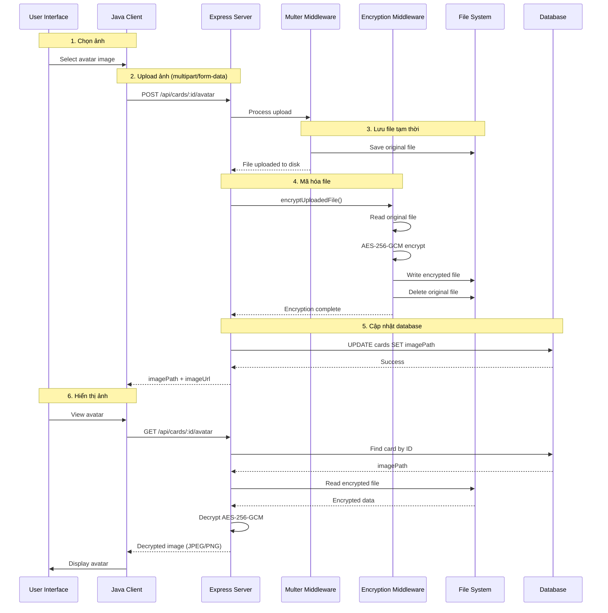

# Quy trình Mã hóa và Giải mã Ảnh Avatar

> [!NOTE]
> Tài liệu này mô tả chi tiết quy trình upload, mã hóa, lưu trữ và giải mã ảnh avatar, bao gồm các bước, files và functions liên quan.

## 📋 Tổng quan

Hệ thống bảo vệ ảnh avatar của người dùng bằng **AES-256-GCM encryption** server-side:
- **Mã hóa**: Ngay sau khi upload, file gốc được mã hóa và thay thế
- **Lưu trữ**: Chỉ lưu file đã mã hóa trên disk, không lưu plaintext
- **Truy cập**: Giải mã on-the-fly khi client request thông qua API endpoint
- **Bảo mật**: Sử dụng AES-256-GCM với IV ngẫu nhiên và authentication tag

### Luồng tổng thể



---

## 🔄 Chi tiết từng bước

### Bước 1: Client chọn và upload ảnh

#### 1.1. User chọn file trong UI

**File**: [`CardInfoPage.java`](file:///e:/Code/javacard/card_gui/src/pages/CardInfoPage.java#L378)

```java
// User clicks "Chọn ảnh" button -> opens file chooser
JFileChooser fileChooser = new JFileChooser();
int result = fileChooser.showOpenDialog(this);
if (result == JFileChooser.APPROVE_OPTION) {
    File selectedFile = fileChooser.getSelectedFile();
    // Upload file
    CardInfo updated = cardApi.uploadAvatar(studentCode, selectedFile);
}
```

#### 1.2. Client gọi API upload

**File**: [`CardApiService.java`](file:///e:/Code/javacard/card_gui/src/api/CardApiService.java#L210-L295)  
**Hàm**: `uploadAvatar(String studentId, File imageFile)`

```java
public CardInfo uploadAvatar(String studentId, java.io.File imageFile) throws IOException {
    // 1. Xác định content type từ extension
    String contentType = "image/jpeg";
    String fileName = imageFile.getName().toLowerCase();
    if (fileName.endsWith(".png")) {
        contentType = "image/png";
    } else if (fileName.endsWith(".gif")) {
        contentType = "image/gif";
    }
    
    // 2. Tạo multipart request body
    okhttp3.RequestBody fileBody = okhttp3.RequestBody.create(
        okhttp3.MediaType.parse(contentType),
        imageFile
    );
    
    okhttp3.RequestBody requestBody = new okhttp3.MultipartBody.Builder()
        .setType(okhttp3.MultipartBody.FORM)
        .addFormDataPart("avatar", imageFile.getName(), fileBody)
        .build();
    
    // 3. Build request với auth token
    okhttp3.Request.Builder builder = new okhttp3.Request.Builder()
        .url(ApiClient.BASE_URL + "/cards/" + studentId + "/avatar")
        .post(requestBody);
    
    // Add Authorization header
    String token = apiClient.getAuthToken();
    if (token != null && !token.isEmpty()) {
        builder.header("Authorization", "Bearer " + token);
    }
    
    // 4. Execute request với timeout 30s (upload có thể lâu)
    okhttp3.OkHttpClient uploadClient = new okhttp3.OkHttpClient.Builder()
        .connectTimeout(10, TimeUnit.SECONDS)
        .readTimeout(30, TimeUnit.SECONDS)
        .writeTimeout(30, TimeUnit.SECONDS)
        .build();
    
    okhttp3.Response response = uploadClient.newCall(request).execute();
    // ... parse response
}
```

**Request format**:
```
POST /api/cards/CT060123/avatar HTTP/1.1
Content-Type: multipart/form-data; boundary=----WebKitFormBoundary...
Authorization: Bearer <JWT_TOKEN>

------WebKitFormBoundary...
Content-Disposition: form-data; name="avatar"; filename="avatar.jpg"
Content-Type: image/jpeg

<binary image data>
------WebKitFormBoundary...--
```

---

### Bước 2: Server nhận upload qua Multer

#### 2.1. Route config

**File**: [`cardRoutes.js`](file:///e:/Code/javacard/server/routes/cardRoutes.js#L19)

```javascript
router.post(
    '/:studentId/avatar', 
    authController.authenticate,           // 1. Verify JWT token
    upload.single('avatar'),               // 2. Multer: save file
    upload.encryptUploadedFile,            // 3. Encrypt file
    cardController.uploadAvatar            // 4. Update database
);
```

#### 2.2. Multer middleware config

**File**: [`upload.js`](file:///e:/Code/javacard/server/middleware/upload.js#L12-L47)

```javascript
// Storage configuration
const storage = multer.diskStorage({
    destination: function (req, file, cb) {
        cb(null, uploadsDir); // uploads/avatars/
    },
    filename: function (req, file, cb) {
        // Format: studentId_timestamp.extension
        const studentId = req.params.studentId || 'unknown';
        const timestamp = Date.now();
        const ext = path.extname(file.originalname);
        const filename = `${studentId}_${timestamp}${ext}`;
        cb(null, filename);
    }
});

// File filter - chỉ chấp nhận ảnh
const fileFilter = (req, file, cb) => {
    const allowedTypes = /jpeg|jpg|png|gif|webp|svg/;
    const extname = allowedTypes.test(path.extname(file.originalname).toLowerCase());
    const mimetype = allowedTypes.test(file.mimetype);
    
    if (mimetype && extname) {
        return cb(null, true);
    } else {
        cb(new Error('Chỉ chấp nhận file ảnh (JPG, PNG, GIF, WEBP, SVG)'));
    }
};

// Multer config
const upload = multer({
    storage: storage,
    limits: {
        fileSize: 5 * 1024 * 1024 // 5MB max
    },
    fileFilter: fileFilter
});
```

**Kết quả**: File gốc được lưu tại `uploads/avatars/CT060123_1704273600000.jpg`

---

### Bước 3: Mã hóa file ngay sau upload

#### 3.1. Encryption middleware

**File**: [`upload.js`](file:///e:/Code/javacard/server/middleware/upload.js#L49-L86)  
**Hàm**: `encryptUploadedFile(req, res, next)`

```javascript
async function encryptUploadedFile(req, res, next) {
    if (!req.file) {
        return next(); // No file uploaded, skip
    }
    
    try {
        const originalPath = req.file.path;
        const tempPath = originalPath + '.tmp';
        
        // 1. Encrypt the file (original -> temp)
        await encryptFile(originalPath, tempPath);
        
        // 2. Replace original with encrypted version
        fs.unlinkSync(originalPath);        // Delete original (plaintext)
        fs.renameSync(tempPath, originalPath); // Rename encrypted to original name
        
        next(); // Continue to controller
    } catch (error) {
        console.error('[ENCRYPTION] Failed to encrypt uploaded file:', error.message);
        
        // Clean up the unencrypted file (security!)
        if (req.file && req.file.path) {
            try {
                fs.unlinkSync(req.file.path);
            } catch (cleanupError) {
                console.error('[ENCRYPTION] Failed to cleanup unencrypted file:', cleanupError.message);
            }
        }
        
        return res.status(500).json({
            success: false,
            message: 'Failed to encrypt uploaded file',
            error: error.message
        });
    }
}
```

**Quan trọng**:
- File gốc (plaintext) được **xóa hoàn toàn** sau khi mã hóa
- Nếu mã hóa thất bại, file gốc cũng bị xóa (để bảo mật)
- File đã mã hóa giữ nguyên tên gốc (để DB path không cần thay đổi)

#### 3.2. Encryption utility

**File**: [`fileEncryption.js`](file:///e:/Code/javacard/server/utils/fileEncryption.js#L90-L98)  
**Hàm**: `encryptFile(inputPath, outputPath)`

```javascript
async function encryptFile(inputPath, outputPath) {
    try {
        // 1. Đọc file gốc
        const data = await fs.readFile(inputPath);
        
        // 2. Mã hóa buffer
        const encrypted = encryptBuffer(data);
        
        // 3. Ghi file đã mã hóa
        await fs.writeFile(outputPath, encrypted);
    } catch (error) {
        throw new Error(`File encryption failed: ${error.message}`);
    }
}
```

**File**: [`fileEncryption.js`](file:///e:/Code/javacard/server/utils/fileEncryption.js#L36-L55)  
**Hàm**: `encryptBuffer(buffer)` - Core encryption logic

```javascript
function encryptBuffer(buffer) {
    try {
        // 1. Lấy encryption key từ environment variable
        const key = getEncryptionKey(); // 32 bytes (256-bit)
        
        // 2. Generate random IV (Initialization Vector)
        const iv = crypto.randomBytes(IV_LENGTH); // 16 bytes
        
        // 3. Tạo cipher với AES-256-GCM
        const cipher = crypto.createCipheriv(ALGORITHM, key, iv);
        // ALGORITHM = 'aes-256-gcm'
        
        // 4. Mã hóa dữ liệu
        const encrypted = Buffer.concat([
            cipher.update(buffer),
            cipher.final()
        ]);
        
        // 5. Lấy Authentication Tag (đảm bảo integrity)
        const authTag = cipher.getAuthTag(); // 16 bytes
        
        // 6. Kết hợp: [IV][Auth Tag][Encrypted Data]
        // Format: [16 bytes IV][16 bytes Auth Tag][Encrypted Data]
        return Buffer.concat([iv, authTag, encrypted]);
    } catch (error) {
        throw new Error(`Encryption failed: ${error.message}`);
    }
}
```

**File**: [`fileEncryption.js`](file:///e:/Code/javacard/server/utils/fileEncryption.js#L15-L29)  
**Hàm helper**: `getEncryptionKey()`

```javascript
function getEncryptionKey() {
    // Đọc key từ environment variable
    const keyHex = process.env.FILE_ENCRYPTION_KEY;
    
    if (!keyHex) {
        throw new Error('FILE_ENCRYPTION_KEY environment variable is not set');
    }
    
    const key = Buffer.from(keyHex, 'hex');
    
    // Validate key length (must be 32 bytes = 256 bits)
    if (key.length !== KEY_LENGTH) { // KEY_LENGTH = 32
        throw new Error(`FILE_ENCRYPTION_KEY must be 64 hex characters (32 bytes)`);
    }
    
    return key;
}
```

**Cấu trúc file đã mã hóa**:

```
+----------------+-------------------+-------------------+
| IV (16 bytes)  | Auth Tag (16 bytes) | Encrypted Data  |
+----------------+-------------------+-------------------+
| Random         | GCM tag           | AES-256 encrypted|
| per file       | for integrity     | image data       |
+----------------+-------------------+-------------------+
```

**Ví dụ**:
- File gốc: `avatar.jpg` (50 KB)
- File mã hóa: `CT060123_1704273600000.jpg` (50 KB + 32 bytes)
  - Bytes 0-15: IV
  - Bytes 16-31: Auth Tag
  - Bytes 32+: Encrypted image data

**Kết quả**: File đã mã hóa được lưu tại `uploads/avatars/CT060123_1704273600000.jpg`

---

### Bước 4: Cập nhật Database

#### 4.1. Controller lưu metadata

**File**: [`cardController.js`](file:///e:/Code/javacard/server/controllers/cardController.js#L237-L289)  
**Hàm**: `uploadAvatar(req, res)`

```javascript
exports.uploadAvatar = async (req, res) => {
    try {
        const { studentId } = req.params;
        
        // 1. Kiểm tra file đã upload (và đã được mã hóa bởi middleware)
        if (!req.file) {
            return res.status(400).json({
                success: false,
                message: 'Không có file ảnh được upload'
            });
        }
        
        // 2. File đã được lưu bởi multer và mã hóa bởi middleware
        // Tên file: studentId_timestamp.extension
        const filename = req.file.filename;
        const imagePath = `uploads/avatars/${filename}`;
        
        // 3. Cập nhật imagePath vào database
        const [updated] = await Card.update(
            { imagePath: imagePath },
            { where: { studentId } }
        );
        
        if (!updated) {
            return res.status(404).json({
                success: false,
                message: 'Không tìm thấy thẻ'
            });
        }
        
        // 4. Lấy card đã cập nhật
        const card = await Card.findOne({ where: { studentId } });
        
        // 5. Trả về response
        res.json({
            success: true,
            message: 'Upload ảnh đại diện thành công',
            data: {
                imagePath: imagePath,
                imageUrl: `/api/cards/${studentId}/avatar`, // URL to decryption endpoint
                card: card
            }
        });
    } catch (error) {
        console.error('Upload avatar error:', error);
        res.status(500).json({
            success: false,
            message: 'Lỗi khi upload ảnh đại diện',
            error: error.message
        });
    }
};
```

**Database update**:
```sql
UPDATE cards 
SET image_path = 'uploads/avatars/CT060123_1704273600000.jpg',
    updated_at = NOW()
WHERE student_id = 'CT060123';
```

**Response to client**:
```json
{
    "success": true,
    "message": "Upload ảnh đại diện thành công",
    "data": {
        "imagePath": "uploads/avatars/CT060123_1704273600000.jpg",
        "imageUrl": "/api/cards/CT060123/avatar",
        "card": {
            "studentId": "CT060123",
            "holderName": "Nguyen Van A",
            "imagePath": "uploads/avatars/CT060123_1704273600000.jpg",
            ...
        }
    }
}
```

---

### Bước 5: Client hiển thị ảnh (Decryption on-the-fly)

#### 5.1. Client request ảnh

**File**: [`CardInfoPage.java`](file:///e:/Code/javacard/card_gui/src/pages/CardInfoPage.java#L384)

```java
// Load ảnh từ decryption endpoint
String imageUrl = ApiConfig.BASE_URL + "/api/cards/" + studentId + "/avatar";
ImageIcon icon = new ImageIcon(new URL(imageUrl));
avatarLabel.setIcon(icon);
```

**HTTP Request**:
```
GET /api/cards/CT060123/avatar HTTP/1.1
Host: localhost:3000
```

#### 5.2. Server route

**File**: [`cardRoutes.js`](file:///e:/Code/javacard/server/routes/cardRoutes.js#L20)

```javascript
router.get('/:studentId/avatar', serveEncryptedAvatar);
// Public endpoint - không cần authentication
// Vì ảnh avatar cần hiển thị công khai
```

#### 5.3. Decryption middleware

**File**: [`serveEncryptedFile.js`](file:///e:/Code/javacard/server/middleware/serveEncryptedFile.js#L9-L87)  
**Hàm**: `serveEncryptedAvatar(req, res)`

```javascript
async function serveEncryptedAvatar(req, res) {
    try {
        const { studentId } = req.params;
        
        // 1. Tìm card trong database
        const { Card } = require('../models');
        const card = await Card.findOne({ where: { studentId } });
        
        if (!card || !card.imagePath) {
            return res.status(404).json({
                success: false,
                message: 'Avatar not found'
            });
        }
        
        // 2. Đọc file đã mã hóa
        const avatarPath = path.join(__dirname, '..', card.imagePath);
        // Example: /path/to/server/uploads/avatars/CT060123_1704273600000.jpg
        
        // Check if file exists
        const fs = require('fs');
        if (!fs.existsSync(avatarPath)) {
            return res.status(404).json({
                success: false,
                message: 'Avatar file not found on disk'
            });
        }
        
        // 3. Đọc encrypted data
        const encryptedData = await fs.promises.readFile(avatarPath);
        
        // 4. Giải mã file
        const decryptedData = decryptBuffer(encryptedData);
        
        // 5. Xác định content type từ extension
        const ext = path.extname(card.imagePath).toLowerCase();
        const contentTypes = {
            '.jpg': 'image/jpeg',
            '.jpeg': 'image/jpeg',
            '.png': 'image/png',
            '.gif': 'image/gif',
            '.webp': 'image/webp',
            '.svg': 'image/svg+xml'
        };
        const contentType = contentTypes[ext] || 'application/octet-stream';
        
        // 6. Set response headers
        res.setHeader('Content-Type', contentType);
        res.setHeader('Content-Length', decryptedData.length);
        res.setHeader('Cache-Control', 'public, max-age=86400'); // Cache 1 day
        
        // 7. Gửi decrypted data về client
        res.send(decryptedData);
        
    } catch (error) {
        console.error('[AVATAR] Error serving avatar:', error.message);
        res.status(500).json({
            success: false,
            message: 'Error serving avatar',
            error: error.message
        });
    }
}
```

#### 5.4. Decryption utility

**File**: [`fileEncryption.js`](file:///e:/Code/javacard/server/utils/fileEncryption.js#L62-L83)  
**Hàm**: `decryptBuffer(encryptedBuffer)`

```javascript
function decryptBuffer(encryptedBuffer) {
    try {
        // 1. Lấy encryption key (giống khi mã hóa)
        const key = getEncryptionKey(); // 32 bytes
        
        // 2. Extract IV, auth tag, và encrypted data
        // Format: [IV (16)][Auth Tag (16)][Encrypted Data]
        const iv = encryptedBuffer.slice(0, IV_LENGTH);
        const authTag = encryptedBuffer.slice(IV_LENGTH, IV_LENGTH + AUTH_TAG_LENGTH);
        const encrypted = encryptedBuffer.slice(IV_LENGTH + AUTH_TAG_LENGTH);
        
        // 3. Tạo decipher với AES-256-GCM
        const decipher = crypto.createDecipheriv(ALGORITHM, key, iv);
        
        // 4. Set authentication tag (verify integrity)
        decipher.setAuthTag(authTag);
        
        // 5. Giải mã dữ liệu
        const decrypted = Buffer.concat([
            decipher.update(encrypted),
            decipher.final() // Throws error if auth tag doesn't match!
        ]);
        
        return decrypted; // Original image data
    } catch (error) {
        throw new Error(`Decryption failed: ${error.message}`);
    }
}
```

**Quan trọng**:
- `decipher.final()` sẽ **throw error** nếu authentication tag không khớp
- Điều này đảm bảo file không bị thay đổi (tamper detection)
- Client nhận được **plaintext image data** trực tiếp

**Kết quả**: Client nhận được ảnh gốc (decrypted) để hiển thị

---

## 📊 Bảng tóm tắt Files và Functions

### Server-side (Node.js)

| File | Function/Middleware | Mục đích |
|------|---------------------|----------|
| [`cardRoutes.js`](file:///e:/Code/javacard/server/routes/cardRoutes.js#L19) | Upload route | Chain middlewares: auth → upload → encrypt → controller |
| [`cardRoutes.js`](file:///e:/Code/javacard/server/routes/cardRoutes.js#L20) | Serve route | Serve decrypted avatar via GET endpoint |
| [`upload.js`](file:///e:/Code/javacard/server/middleware/upload.js#L12-L47) | Multer config | Configure file upload (destination, filename, filter, limits) |
| [`upload.js`](file:///e:/Code/javacard/server/middleware/upload.js#L53-L86) | `encryptUploadedFile()` | Middleware: mã hóa file sau upload, xóa plaintext |
| [`fileEncryption.js`](file:///e:/Code/javacard/server/utils/fileEncryption.js#L15-L29) | `getEncryptionKey()` | Lấy 256-bit key từ environment variable |
| [`fileEncryption.js`](file:///e:/Code/javacard/server/utils/fileEncryption.js#L36-L55) | `encryptBuffer()` | **Core encryption**: AES-256-GCM, random IV, auth tag |
| [`fileEncryption.js`](file:///e:/Code/javacard/server/utils/fileEncryption.js#L62-L83) | `decryptBuffer()` | **Core decryption**: verify auth tag, decrypt data |
| [`fileEncryption.js`](file:///e:/Code/javacard/server/utils/fileEncryption.js#L90-L98) | `encryptFile()` | File-level encryption wrapper |
| [`cardController.js`](file:///e:/Code/javacard/server/controllers/cardController.js#L237-L289) | `uploadAvatar()` | Lưu imagePath vào database, trả response |
| [`serveEncryptedFile.js`](file:///e:/Code/javacard/server/middleware/serveEncryptedFile.js#L9-L87) | `serveEncryptedAvatar()` | **Serve decrypted image** on-the-fly |

### Client-side (Java Desktop)

| File | Function | Mục đích |
|------|----------|----------|
| [`CardInfoPage.java`](file:///e:/Code/javacard/card_gui/src/pages/CardInfoPage.java#L378) | Upload button handler | Mở file chooser, gọi API upload |
| [`CardInfoPage.java`](file:///e:/Code/javacard/card_gui/src/pages/CardInfoPage.java#L384) | Display avatar | Load ảnh từ decryption endpoint |
| [`CardApiService.java`](file:///e:/Code/javacard/card_gui/src/api/CardApiService.java#L210-L295) | `uploadAvatar()` | Tạo multipart request, gửi file lên server |

---

## 🔐 Chi tiết thuật toán AES-256-GCM

### Về AES-256-GCM

**AES (Advanced Encryption Standard)**:
- Block cipher: mã hóa theo từng block 128-bit
- Key size: **256-bit** (32 bytes) - very strong
- Mode: **GCM** (Galois/Counter Mode)

**GCM Mode** (Galois/Counter Mode):
- **Authenticated Encryption**: Vừa mã hóa, vừa đảm bảo integrity
- **Authentication Tag**: 128-bit tag để verify dữ liệu không bị thay đổi
- **IV (Initialization Vector)**: 128-bit random nonce, unique mỗi lần mã hóa
- **Performance**: Rất nhanh, có thể parallel processing

### Tại sao dùng GCM?

1. **Confidentiality**: Dữ liệu được mã hóa, không ai đọc được
2. **Integrity**: Auth tag đảm bảo dữ liệu không bị thay đổi
3. **Authenticity**: Chỉ người có key mới tạo được valid ciphertext
4. **Performance**: Nhanh hơn CBC + HMAC

### So sánh với các mode khác

| Mode | Encryption | Authentication | Parallel | Speed |
|------|-----------|----------------|----------|-------|
| **GCM** | ✅ | ✅ | ✅ | ⚡⚡⚡ |
| CBC | ✅ | ❌ | ❌ | ⚡⚡ |
| CTR | ✅ | ❌ | ✅ | ⚡⚡⚡ |
| CBC+HMAC | ✅ | ✅ | ❌ | ⚡ |

### Encryption process

```
Input: Plaintext image data (P)
Key: 256-bit key (K) from environment variable
IV: 128-bit random nonce (generated per file)

1. Counter Mode Encryption:
   C = AES-256-CTR(K, IV, P)

2. GHASH Authentication:
   T = GHASH(K, C)
   
Output: [IV || T || C]
        (16 bytes || 16 bytes || ciphertext)
```

### Decryption process

```
Input: [IV || T || C]
Key: 256-bit key (K) from environment variable

1. Extract components:
   IV = first 16 bytes
   T  = next 16 bytes
   C  = remaining bytes

2. Verify authentication:
   T' = GHASH(K, C)
   if T ≠ T': throw error (tampered!)

3. Decrypt:
   P = AES-256-CTR(K, IV, C)
   
Output: Plaintext image data (P)
```

---

## 🔒 Bảo mật

### Điểm mạnh

1. **Strong Encryption**: AES-256 với 256-bit key (virtually unbreakable)
2. **Authenticated Encryption**: GCM mode đảm bảo integrity + confidentiality
3. **Unique IV per file**: Mỗi file có IV riêng, ngăn pattern analysis
4. **No plaintext on disk**: File gốc bị xóa ngay sau khi mã hóa
5. **Decryption on-the-fly**: Không lưu decrypted file, chỉ stream về client
6. **Key management**: Key lưu trong environment variable, không hard-code

### Key security

**Environment Variable** (`FILE_ENCRYPTION_KEY`):
```bash
# .env file (NOT committed to git)
FILE_ENCRYPTION_KEY=a1b2c3d4e5f6789012345678901234567890abcdef1234567890abcdef123456
```

**Generate secure key**:
```javascript
const crypto = require('crypto');
const key = crypto.randomBytes(32).toString('hex');
console.log(key); // 64 hex characters = 32 bytes
```

### Threat model

| Threat | Mitigated? | How |
|--------|------------|-----|
| **Disk theft** | ✅ | Files encrypted with strong key |
| **Unauthorized access** | ✅ | Plaintext never stored on disk |
| **File tampering** | ✅ | GCM auth tag detects modifications |
| **Key compromise** | ⚠️ | Partial - key in env var, not HSM |
| **Replay attacks** | ✅ | Unique IV per file |
| **Pattern analysis** | ✅ | Random IV prevents pattern leakage |

### Điểm yếu tiềm ẩn

1. **Key Storage**: Key lưu trong `.env` file, nếu server bị hack thì key lộ
2. **Single Key**: Tất cả files dùng chung 1 key, nếu key lộ thì tất cả file lộ
3. **No Key Rotation**: Không có cơ chế rotate key định kỳ
4. **Memory exposure**: Decrypted data tồn tại trong memory khi serve
5. **No rate limiting**: Attacker có thể brute-force requests (DoS)

### Khuyến nghị cải thiện

#### 1. Key Management

```javascript
// Option A: Per-card encryption key (derived from master key)
const cardKey = crypto.pbkdf2Sync(
    MASTER_KEY, 
    studentId,  // salt
    100000,     // iterations
    32,         // key length
    'sha256'
);

// Option B: Use Hardware Security Module (HSM)
const AWS_KMS = require('aws-sdk/clients/kms');
const kms = new AWS_KMS();
```

#### 2. Key Rotation

```javascript
// Version trong metadata
const encryptedFile = {
    version: 2,  // key version
    iv: '...',
    authTag: '...',
    data: '...'
};

// Decrypt với key tương ứng
const key = getKeyByVersion(encryptedFile.version);
```

#### 3. Access Control

```javascript
// Require authentication for avatar access (trong một số trường hợp)
router.get('/:studentId/avatar', 
    authController.authenticate,  // Optional: require login
    rateLimit({ windowMs: 60000, max: 100 }), // Rate limiting
    serveEncryptedAvatar
);
```

---

## 🧪 Testing Flow

### Test Case 1: Upload thành công

```
1. Client chọn file JPG (2MB) → ✓
2. POST /api/cards/CT060123/avatar → ✓ 200 OK
3. Multer save file → ✓ uploads/avatars/CT060123_xxx.jpg
4. Encrypt file → ✓ File replaced with encrypted version
5. Delete plaintext → ✓ No plaintext file on disk
6. Update DB → ✓ imagePath = "uploads/avatars/CT060123_xxx.jpg"
7. Response → ✓ { imagePath, imageUrl }
```

### Test Case 2: File quá lớn

```
1. Client chọn file 10MB → ✗
2. POST /api/cards/CT060123/avatar → ✗ 400 Bad Request
3. Multer rejects → ✗ "File too large (max 5MB)"
4. No file saved → ✓ Disk clean
```

### Test Case 3: File không phải ảnh

```
1. Client chọn file .pdf → ✗
2. POST /api/cards/CT060123/avatar → ✗ 400 Bad Request
3. Multer rejects → ✗ "Chỉ chấp nhận file ảnh"
4. No file saved → ✓ Disk clean
```

### Test Case 4: Encryption failure

```
1. Client chọn file JPG → ✓
2. Multer save → ✓
3. Encrypt fails (key missing) → ✗
4. Cleanup triggered → ✓ Plaintext file deleted
5. Response → ✗ 500 "Failed to encrypt uploaded file"
```

### Test Case 5: Serve decrypted avatar

```
1. GET /api/cards/CT060123/avatar → ✓
2. Find card in DB → ✓ imagePath found
3. Read encrypted file → ✓ Buffer loaded
4. Decrypt → ✓ Plaintext image
5. Set headers → ✓ Content-Type: image/jpeg
6. Stream to client → ✓ Image displayed
```

### Test Case 6: Tampered file

```
1. Attacker modifies encrypted file → ✗
2. GET /api/cards/CT060123/avatar → ✓
3. Read encrypted file → ✓
4. Decrypt → ✗ Auth tag mismatch!
5. Response → ✗ 500 "Decryption failed"
```

---

## 🎯 Lưu ý quan trọng

> [!IMPORTANT]
> **File Lifecycle**:
> - **Upload**: Client gửi plaintext → Server nhận → Ngay lập tức mã hóa
> - **Storage**: **CHỈ lưu encrypted file** trên disk, không bao giờ lưu plaintext
> - **Access**: Giải mã on-the-fly khi client request, không cache plaintext
> - **Delete**: Khi xóa card, cần xóa cả file encrypted trên disk

> [!WARNING]
> **Key Management**:
> - Key MUST có độ dài **exactly 32 bytes** (64 hex characters)
> - Key MUST được lưu trong environment variable, **KHÔNG hard-code**
> - `.env` file MUST **KHÔNG** được commit vào git
> - Production key MUST khác development key

> [!CAUTION]
> **Security Considerations**:
> - Nếu **key bị lộ**, tất cả files có thể bị giải mã
> - Backup key an toàn, nếu mất key thì **không thể decrypt** files
> - Rotate key định kỳ (nhưng cần re-encrypt tất cả files cũ)
> - Consider using HSM/KMS cho production environment

---

## 📈 Performance Considerations

### Upload Performance

- **Multer**: Rất nhanh, stream directly to disk
- **Encryption**: O(n) với n = file size, ~50MB/s on average CPU
- **Total overhead**: Thêm ~2-5% time cho encryption

### Serve Performance

- **Decryption**: O(n), tương tự encryption
- **Caching**: Response có `Cache-Control` header, browser cache 1 day
- **CDN**: Có thể cache decrypted avatar tại CDN (nếu public)

### Optimization Tips

1. **Lazy decryption**: Chỉ decrypt khi có request (đã implement)
2. **Memory stream**: Stream decrypted data thay vì buffer toàn bộ
3. **CDN caching**: Cache decrypted avatar tại CDN edge
4. **Image optimization**: Compress ảnh trước khi upload (client-side)

---

## 🔄 Comparison: Image Encryption vs AES Key Encryption

| Aspect | Image Encryption | AES Key Encryption |
|--------|------------------|-------------------|
| **Algorithm** | AES-256-GCM | RSA-1024 + AES-128 |
| **Encryption location** | Server-side | Hybrid (Server + Card) |
| **Key storage** | Environment variable | Card Private Key + Server |
| **Key size** | 256-bit | 1024-bit RSA, 128-bit AES |
| **Per-item key** | No (shared key) | Yes (per-card derived) |
| **Authentication** | GCM auth tag | None (confidentiality only) |
| **Performance** | Fast (symmetric) | Slower (asymmetric + symmetric) |
| **Use case** | File encryption | Key exchange |

---

## 📚 Related Documentation

- [AES Key Retrieval Flow](./aes-key-retrieval-decryption-flow.md) - Quy trình lấy và giải mã AES Key
- [AES Overview](./overview.md) - Tổng quan về AES encryption trong hệ thống
- [Storage Format](./storage-format.md) - Format lưu trữ dữ liệu đã mã hóa
